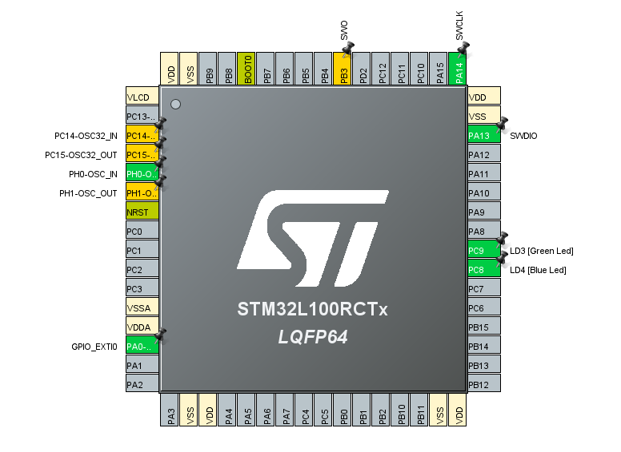

# Uporaba tipke kot prekinitev z STM32L1 Discovery

## Cilj naloge

S pomočjo programskega okolja STM32CubeIDE in HAL knjižnicami sprogramirajte mikroprocesor tako, da bo ob pritisku modre tipke kot prekinitev na STM32L1 se prižgala/ugasnila zelena LED. Modra LED pa vedno utripa.

## Postopek inicializacije periferije

- **PA0**
- **PC9** (zelena) , **PC8** (modra).
- *HAL_GPIO_TogglePin(GPIO**C**, GPIO_PIN_**9**);*
- **9999** milisekund.
- *HAL_GPIO_TogglePin(GPIO**C**, GPIO_PIN_**8**);*
- *HAL_Delay(500);*
- Ob pritisku na moder gumb se z LED nič ne zgodi.
- Ne ker je v kodi napsiano tako, da modra tipka ne vpliva na LED.

# Pinout

